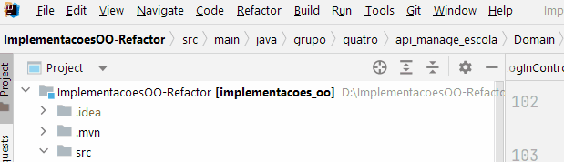

# Para rodar o projeto:

### 1) Executar o back-end (Intellij):

1. Na aba File, ir em New > Project From Existing Resources.  
  

2. Selecionar a pasta do repositório, confirmar e posteriormente _Maven_ como modelo e confirmar.   
  
3. Carregar/recarregar as dependências clicando na secção Maven no canto superior direito da tela e posteriormente no ícone de recarregar "Reload all Maven projects".  
  
4. Na parte superior da tela, clicar no ícone de formato de play "Run 'ApiManageEscolaApplication'".  
  
O back-end está pronto para ser usado quando a seguinte mensagem aparecer:  
  


### 2) Executar o front-end:
1. Abrir o projeto na IDE de sua escolha apenas o diretório do front-end do projeto:
```
cd ImplementacoesOO-Refactor
cd src
cd front
```  
2. Usando o método do seu IDE, abrir o arquivo login.html no seu navegador.

# Code Smells:
O relatório de apontamento dos Code Smells no projeto se encontra no seguinte link: https://docs.google.com/document/d/1kmaEwtIO-MWt8JjmOEERhKozLnHjrbEzG71Pwkf21cc/edit?usp=sharing